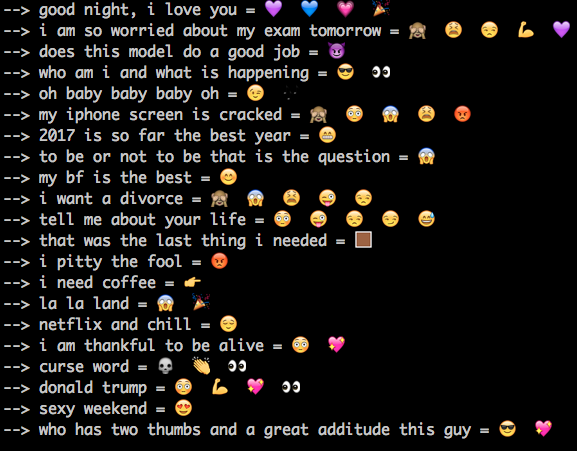

# Urban Emoji

 

## Overview
Keeping up with language trends and the new 'hip slang' can be challenging for anyone outside of high school.

Urban Emoji solves this by using natural language processing (NLP) and Data Science modeling (NMF, Naive Bayes) on Twitter data to interpret slang meanings of emojis and predict what emoji would go best with your next tweet.

- [Process](#process)
- [Results](#results)
- [Real World Application](#real-world-application)
- [Tech Stack](#tech-stack)
- [More Projects](#more-projects)

## Process

#### Collecting the Data
- Using Twitter API to download tweets
- Use AWS to run the Twitter API using EC2 and automatically save the tweets to a bucket on S3
- Use a cron job to automatically download tweets every day
#### Cleaning & Processing the data
- Identify tweets that contain emojis
- Process the tweets and use the emojis as labels
- Vectorize the tweets using tfidf and count-vectorizer
#### Modeling
- Utilize NMF and topic modeling to cluster similar tweets to identify emojis that have similar meanings
- Create a emoji predictor using Naive Bayes
- Identify words commonly associated with each emoji
    - Extracted from the NMF and the Naive Bayes models
#### Model Validation
- Test on a subset of tweets that the model was not trained on
- User interaction
    - Allow for a text entry
    - Predict multiple emojis using model
    - Allow user to select more appropriate emoji
    - Save text and selected emoji as new labeled data

## Results

#### Initial Results (3 FEB 2017)
Below is a proof-of-concept example of the results, as you can see the crying emoji is most often affiliated with the words above for that group. The hashtags #girlposts and #femaletexts are associated with this emoji which show an indication of what type of people are commonly using it on Twitter.

As I add more and more tweets and use different techniques I expect to get further improve the slang definitions and also get insight on the type of people who use each emoji.

#### Predictive Results (22 MAR 2017)
Once the Naive Bayes predictor was running, I tested a collection of short sentences to see if the predictions made sense. Below you can see these sentences for yourself and up to 5 predicted emojis. The model ended up doing pretty well, but could use more tweaking to make it great. Ideas include, more text processing (lemmatizing), more data, and/or other model options (logistic regression).

## Real World Application

The emoji information Urban Emoji discovers is not useful for impressing the younger generation on how hip you are but also has purpose in other Data Science projects and business applications. Below are just a few example of where this technology could be used:

#### Data Science Applications
- Use emojis as labels for text documents
- Replace emojis with a list of words that define it to improve NLP analysis of short text documents
- Improve predictive text algorithms to better recommend an appropriate emoji

#### Business Applications
- Correctly use emojis in a company's social media posts to connect with the intended audience
- Aid in better identifying what the audience of a product/company/business actually is

## Tech Stack
- Twitter’s API & Tweepy
- Python
- Pandas & numpy
- Scikit-Learn
- Unicode
- AWS, S3, & EC2
- Crontab

## More Projects
Please feel free to check out my project With New Belgium Brewery called [Seeing Taste](https://github.com/janvanzeghbroeck/Seeing-Taste)

[Linkedin](https://www.linkedin.com/in/janvanzeghbroeck/)
