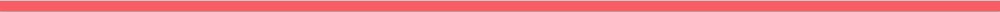

# Urban Emoji

Urban Emoji uses natural language processing (nlp) and non-negative matrix factorization (nmf) to interpret slang meanings of emojis from analyzing tweets.

## Process

- Using Twitter API to download tweets
- Identify tweets that contain emojis
- Process the tweets and use the emojis as labels
- Vectorize the tweets using tfidf
- Use NMF and topic modeling to group the tweets and print most common words in each topic
- Print the emojis associated with the tweets in each topic
- Find topics with a large percentage of similar emojis to connects words and emojis
- Currently applying NMF for tweets all with similar emojis to further identify associated words to find their slang definitions

## Results

Below is an example of the results, as you can see the crying emoji is most often affiliated with the words above for that group. The results show proof of concept and the next step

## Tech Stack
Twitter’s API, Python, Pandas, Scikit-Learn, Unicode

## Seeing Taste
Please feel free to check out my project With New Belgium Brewery called [Seeing Taste](https://github.com/janvanzeghbroeck/Seeing-Taste)

[Linkedin](https://www.linkedin.com/in/janvanzeghbroeck/)
